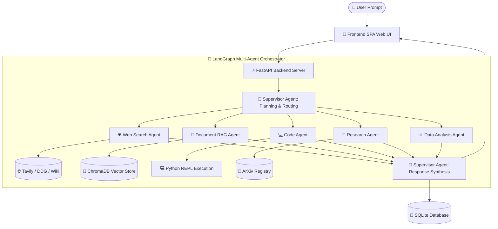

<div align="center">

# ⚡ OmniAgent AI

### Autonomous Multi-Agent AI Orchestration Platform
*Powered by LangGraph, FastAPI, ChromaDB Vector RAG, Google Gemini 3.6 Flash, and Ollama*

[](https://python.org)
[](https://fastapi.tiangolo.com)
[](https://langchain-ai.github.io/langgraph/)
[](https://www.trychroma.com)
[](https://ai.google.dev)
[](LICENSE)

[Features](#-key-features) • [Architecture](#%EF%B8%8F-system-architecture) • [Sub-Agents](#-sub-agent-team) • [Installation](#-installation--setup) • [API Docs](#-api-endpoints) • [Exporting](#-chat-export-capabilities)

</div>

---

## 📌 Table of Contents
- [Overview](#-overview)
- [Key Features](#-key-features)
- [Sub-Agent Team](#-sub-agent-team)
- [System Architecture](#%EF%B8%8F-system-architecture)
- [Tech Stack](#-tech-stack)
- [Installation & Setup](#-installation--setup)
- [Environment Variables](#-environment-variables)
- [API Endpoints](#-api-endpoints)
- [Chat Export Capabilities](#-chat-export-capabilities)
- [Project Structure](#-project-structure)
- [License](#-license)

---

## 📖 Overview

**OmniAgent AI** is a production-ready, open-source **Multi-Agent AI Platform** designed to solve complex user tasks through dynamic agent delegation and synthesis. Built using **LangGraph** state-graph flows and **FastAPI**, OmniAgent routes queries across specialized AI agents—ranging from real-time web search and document RAG to python code execution and academic research paper parsing.

Unlike traditional single-prompt chatbots, OmniAgent AI orchestrates **multi-agent pipelines** where multiple specialized agents collaborate on a single prompt, passing context to the Supervisor Agent to produce unified, expert-level Markdown answers.

---

## ✨ Key Features

- 🧠 **LangGraph Multi-Agent Engine**: State-graph routing with real-time agent execution visualizer & reasoning logs.
- ⚡ **Multi-Agent Collaboration**: Simultaneously delegates complex tasks across Web Search, Code Generation, and Data Analytics agents.
- 📄 **Document RAG Knowledge Hub**: Vector semantic search powered by ChromaDB for querying PDF, DOCX, XLSX, and text documents.
- 🌐 **Real-time Live Web Search**: Integrates Tavily AI, DuckDuckGo, and Wikipedia APIs for up-to-date real-world factual responses.
- 🔬 **Academic Paper Research**: Native ArXiv paper abstracts search & Wikipedia encyclopedia synthesis.
- 💻 **Python Code Execution (REPL)**: Safe sandboxed execution of generated Python scripts for data visualization and math computations.
- 📤 **Chat Exporting (TXT & PDF)**: Export full agent conversation history into styled `.txt` or printable `.pdf` documents.
- 🎨 **Modern Glassmorphic UI**: High-end dark theme, responsive sidebar layout, model switcher, and real-time node badges.
- 🔄 **Dual Provider Support**: Seamless switching between **Google Gemini (3.6 Flash / Pro)** and **Local Ollama**.

---

## 🤖 Sub-Agent Team

| Agent | Icon | Primary Role | Core Tools & Frameworks |
| :--- | :---: | :--- | :--- |
| **Supervisor Agent** | 🧠 | Task Planning, Multi-Agent Delegation, & Synthesis | LangGraph, LLM Provider Factory |
| **Web Search Agent** | 🌐 | Real-time Web Search, News, & Current Events | Tavily AI, DuckDuckGo, Wikipedia |
| **Document RAG Agent**| 📄 | Vector Database Querying & PDF Summarization | ChromaDB, Nomic Embeddings, PDF Parser |
| **Code Agent** | 💻 | Polyglot Code Generation, Refactoring, & Debugging | Python REPL, Syntax Formatter |
| **Research Agent** | 🔬 | Academic Literature Search & Paper Abstracts | ArXiv API, Wikipedia Search |
| **Data Analysis Agent**| 📊 | Tabular Data Analytics & Math Computations | Calculator, Pandas, Statistics |
| **Document Parser** | 📑 | Document Layout Extraction & Metadata Parsing | OCR Engine, PyPDF, Docx Parser |
| **Memory Agent** | 💾 | Conversational Continuity & SQLite Session History | SQLite, SQLAlchemy Async |

---

## 🛠️ System Architecture



---

## 💻 Tech Stack

- **Backend Framework**: FastAPI, Pydantic v2, Python 3.10+
- **Agent Orchestration**: LangGraph, LangChain Core
- **Vector Database**: ChromaDB (Persistent Embeddings)
- **LLM Providers**: Google Gemini API (`gemini-3.6-flash`), Ollama (Local LLMs: LLaMA 3.2, Qwen 2.5)
- **Database**: Async SQLAlchemy, SQLite, aiosqlite
- **Frontend**: HTML5, Vanilla JavaScript (ES6+), CSS3 (Modern Glassmorphism Design System)
- **Search & Tools**: Tavily AI, DuckDuckGo Search, ArXiv API, Wikipedia API

---

## 🚀 Installation & Setup

### 1. Clone the Repository
```bash
git clone https://github.com/manishPawar007/Multi-Agent-System.git
cd Multi-Agent-System
```

### 2. Set Up Virtual Environment & Install Dependencies
```bash
# Create virtual environment
python -m venv .venv

# Activate environment (Windows)
.venv\Scripts\activate

# Activate environment (Linux/macOS)
source .venv/bin/activate

# Install requirements
pip install -r requirements.txt
```

### 3. Environment Variables Configuration
Create a `.env` file in the project root directory:

```env
PROJECT_NAME="OmniAgent AI"
ENVIRONMENT="development"
DEBUG=True

# LLM Configurations
DEFAULT_LLM_PROVIDER="gemini"
DEFAULT_LLM_MODEL="gemini-3.6-flash"
GEMINI_API_KEY="your_google_gemini_api_key_here"
TAVILY_API_KEY="your_tavily_api_key_here"

# Database & Storage
DATABASE_URL="sqlite+aiosqlite:///./omniagent.db"
SECRET_KEY="your_jwt_secret_key_here"

# Ollama Fallback (Optional)
OLLAMA_BASE_URL="http://localhost:11434"
```

### 4. Run the Backend API Server
Start the server from the root directory:
```bash
python -m uvicorn backend.app.main:app --reload --port 8001
```

### 5. Open Web Application
Open your web browser and navigate to:
- **Application URL**: `http://localhost:8001` or open `frontend/index.html` directly.
- **Interactive API Documentation (Swagger)**: `http://localhost:8001/docs`

---

## 📡 API Endpoints

| Method | Endpoint | Description |
| :--- | :--- | :--- |
| `POST` | `/api/v1/auth/register` | Register a new user account |
| `POST` | `/api/v1/auth/login` | Login and retrieve JWT access token |
| `GET` | `/api/v1/auth/me` | Fetch authenticated user profile details |
| `GET` | `/api/v1/chats` | List all user chat conversations |
| `POST` | `/api/v1/chats` | Create a new chat session |
| `POST` | `/api/v1/chats/messages` | **Send prompt to Multi-Agent Engine & receive response** |
| `POST` | `/api/v1/documents/upload` | Upload PDF/Office document & generate ChromaDB vector chunks |
| `GET` | `/api/v1/documents` | List indexed RAG documents |
| `GET` | `/api/v1/agents` | Fetch active sub-agents status |
| `GET` | `/api/v1/dashboard/stats` | Retrieve platform metrics and system health |

---

## 📥 Chat Export Capabilities

OmniAgent AI supports exporting complete conversation histories directly from the UI:
- **Export TXT**: Downloads conversation with complete timestamps, user prompts, sub-agent outputs, and metadata as a formatted plain text (`.txt`) file.
- **Export PDF**: Opens a styled, printable document view that triggers browser PDF print rendering (`window.print()`).

---

## 📁 Project Structure

```text
Multi-Agent-System/
├── backend/
│   ├── app/
│   │   ├── agents/            # LangGraph specialized sub-agents
│   │   ├── api/               # FastAPI route controllers
│   │   ├── auth/              # JWT auth middleware & password security
│   │   ├── config/            # Pydantic environment settings
│   │   ├── database/          # Async SQLite session management
│   │   ├── graph/             # StateGraph multi-agent execution pipeline
│   │   ├── llm/               # Gemini 3.6 Flash & Ollama providers
│   │   ├── models/            # Database ORM entities
│   │   ├── rag/               # ChromaDB vector store & parsers
│   │   ├── schemas/           # Pydantic request/response schemas
│   │   ├── services/          # Business logic services
│   │   ├── tools/             # Search APIs, Python REPL, & Calculator
│   │   └── utils/             # Logging & robust LLM text extractors
│   ├── chroma_db/             # Local ChromaDB persistent vector index
│   └── uploads/               # Uploaded PDF document storage
├── frontend/
│   ├── index.html             # Single Page Application HTML
│   ├── css/                   # Modern glassmorphism dark theme styles
│   └── js/                    # SPA router, API client, & chat UI controllers
├── docker-compose.yml         # Container orchestration manifest
├── Dockerfile                 # Production Docker container build
├── README.md                  # Project documentation
└── requirements.txt           # Python dependencies manifest
```

---

## 📜 License

This project is licensed under the **MIT License**. Feel free to use, modify, and distribute it for personal or commercial applications.
